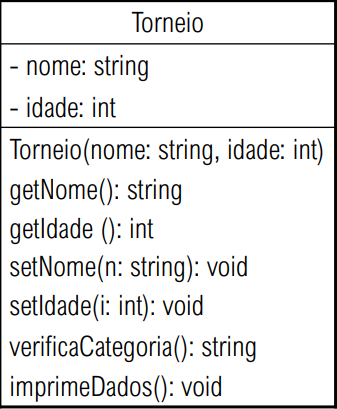

# Torneio

  # UML
  
  
  
  # Funcionalidades
  
    # - O método imprimirDados imprime o estado do objeto inclusive sua categoria;
    # - O método verificarCategoria deverá retornar qual a categoria do atleta baseado na tabela abaixo:
    
   
    
